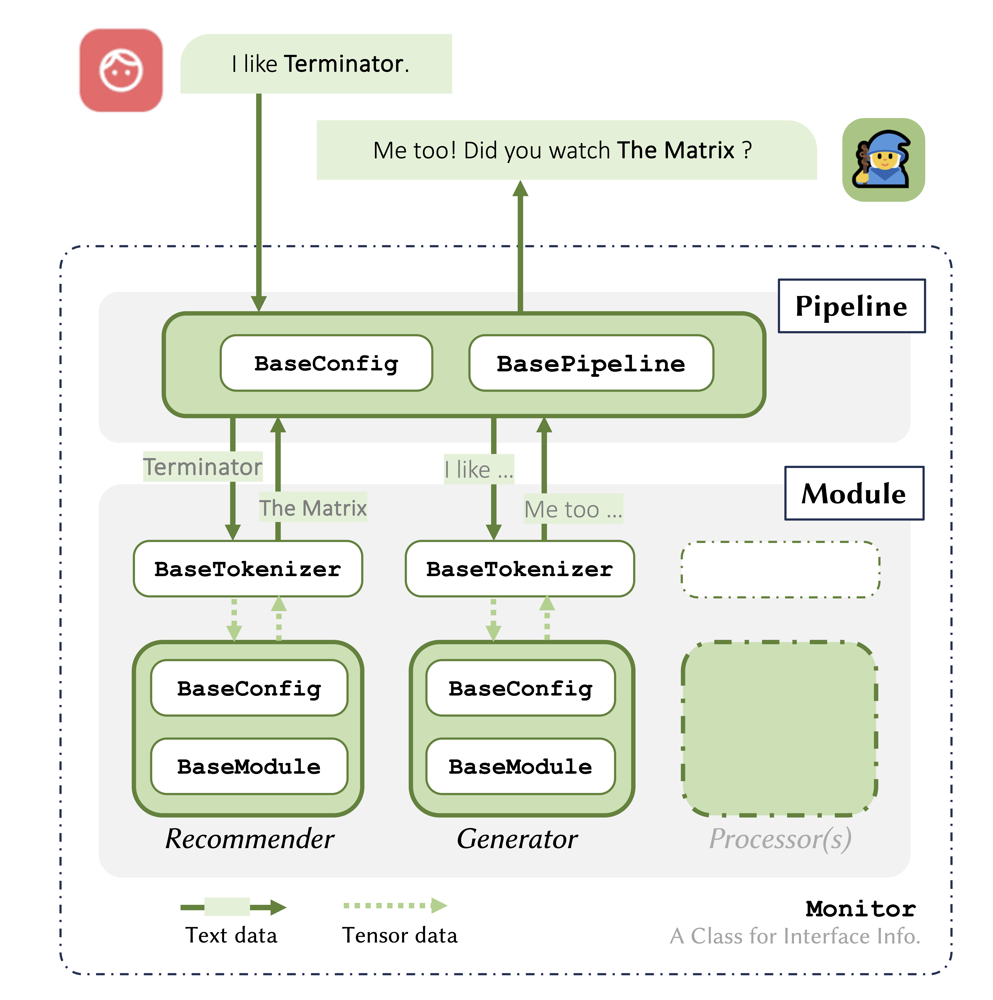

#  RecWizard
### A Plug-n-Play Toolkit for Conversational Recommenders with Modular, Portable Models and Interactive User Interface
 <a href='https://huggingface.co/recwizard'></a>
#### (accepted at AAAI 2024 Demo Track)

## Overview

The RecWizard libary is built for easy deployment/development of Conversational Recommender Systems(CRS).
The core idea of RecWizard is to use a "Text-in, Text-out" interface for all kinds of different modules
used in a CRS pipeline. The text-based interface gives our package a **plug-and-play** nature that allows users to
easily experiment with new combinations of modules.

## Base Concept

We abstract a CRS model into two levels as shown in the figure below:

- **Module Level**: We typically provide a `recwizard.BaseModule` for making recommendations and
  another `rectbot.BaseModule` for generating natural-language responses.
  We can further introduce processor `rectbot.BaseModule` to extract important information (e.g., entity linking) from
  users' raw features;
- **Model Level**: We treat a `recwizard.BasePipeline` as a high-level manager to decide when and how to call the
  lower-level modules, and how to combine the results from such modules.

 

## Quick start

Take `ExpansionPipeline` for example, you can build a ChatGPT-based expansion model with the classic AutoRec module
<sup>1</sup> in a few lines:

#### 1.Setup the pipeline

```python
from recwizard import ExpansionConfig, ExpansionPipeline
from recwizard import ChatgptGen, RedialRec

pipeline = ExpansionPipeline(
  ExpansionConfig(),
  rec_module=RedialRec.from_pretrained('recwizard/redial-rec'),
  gen_module=ChatgptGen.from_pretrained('recwizard/chatgpt-expansion')
)

```

#### 2. Format the input

you would want to format your dialogue history like this before passing it to the pipeline:

```python
context = "<sep>".join([
  "User: Hello!",
  "System: Hello, I have some movie ideas for you. Have you watched the movie <entity>Forever My Girl (2018)</entity> ?",
  "User: Looking for movies in the comedy category. I like Adam Sandler movies like <entity>Billy Madison (1995)</entity> Oh no is that good?"
])
```

> Currently. The formatting contains 3 aspects:
> 1. We prepend the sender of the message to the beggining of the sentence. Either "User: " or "System: "
> 2. We join the utterances with the \<sep\> token. which can be handled differently by different tokenizers
> 3. (Optional) We mark the entities in the text manually so that the named entities can be extracted by the downstream
     modules.

#### 3. Get Response!

```python
print(pipeline.response(context))
```

```bash
System: If you're a fan of Adam Sandler, you might enjoy "50 First Dates (2004)" which is a romantic comedy featuring him and Drew Barrymore. 
Another one is "Big Daddy (1999)" where Sandler's character adopts a kid to impress his girlfriend, but things don't go as planned. 
Both movies have Sandler's signature humor and are quite entertaining.
```
## Implemented Modules

| Base Model | Recommender Module                                           | Generator Module                                             |
| ---------- | ------------------------------------------------------------ | ------------------------------------------------------------ |
| ReDIAL     | [redial-rec](https://huggingface.co/recwizard/redial-rec)    | [redial-gen](https://huggingface.co/recwizard/redial-gen)    |
| KBRD       | [kbrd-rec-redial](https://huggingface.co/recwizard/kbrd-rec-redial) | [kbrd-rec-redial](https://huggingface.co/recwizard/kbrd-gen-redial) |
| UniCRS     | [unicrs-rec-redial](https://huggingface.co/recwizard/unicrs-rec-redial)/[unicrs-rec-inspired](https://huggingface.co/recwizard/unicrs-rec-inspired) | [unicrs-gen-redial](https://huggingface.co/recwizard/unicrs-gen-redial)/[unicrs-gen-inspired](https://huggingface.co/recwizard/unicrs-gen-inspired) |
| KGSF       | [kgsf-rec](https://huggingface.co/recwizard/kgsf-rec)                                                     | [kgsf-gen](https://huggingface.co/recwizard/kgsf-gen)                                                     |
| ChatGPT    | [chatgpt-rec-fillblank](https://huggingface.co/recwizard/chatgpt-rec-fillblank) | [chatgpt-gen-fillblank](https://huggingface.co/recwizard/chatgpt-gen-fillblank)/[chatgpt-gen-expansion](https://huggingface.co/recwizard/chatgpt-gen-expansion) |
| Llama2     |                                                              | [llama-expansion](https://huggingface.co/recwizard/llama-expansion) |


## Code Structure

```bash
recwizard
├── __init__.py
├── configuration_utils.py
├── model_utils.py
├── module_utils.py
├── modules
│   ├── __init__.py
│   ├── llm
│   │   ├── __init__.py
│   │   ├── configuration_chatgpt_gen.py
│   │   ├── configuration_chatgpt_rec.py
│   │   ├── modeling_chatgpt_gen.py
│   │   ├── modeling_chatgpt_rec.py
│   │   └── tokenizer_chatgpt.py
│   ├── kbrd
│   │   ├── configuration_kbrd_gen.py
│   │   ├── configuration_kbrd_rec.py
│   │   ├── modeling_kbrd_rec.py
│   │   ├── shared_encoder.py
│   │   └── tokenizer_kbrd_rec.py
│   ├── redial
│   │   ├── __init__.py
│   │   ├── autorec.py
│   │   ├── beam_search.py
│   │   ├── configuration_redial_gen.py
│   │   ├── configuration_redial_rec.py
│   │   ├── hrnn.py
│   │   ├── hrnn_for_classification.py
│   │   ├── modeling_redial_gen.py
│   │   ├── modeling_redial_rec.py
│   │   ├── params.py
│   │   ├── tokenizer_redial_gen.py
│   │   ├── tokenizer_redial_rec.py
│   │   └── tokenizer_rnn.py
│   └── unicrs
│       ├── __init__.py
│       ├── configuration_unicrs_gen.py
│       ├── configuration_unicrs_rec.py
│       ├── kg_prompt.py
│       ├── modeling_unicrs_gen.py
│       ├── modeling_unicrs_rec.py
│       ├── prompt_gpt2.py
│       ├── tokenizer_unicrs_gen.py
│       └── tokenizer_unicrs_rec.py
├── pipelines
│   ├── __init__.py
│   ├── chatgpt
│   │   ├── __init__.py
│   │   ├── configuration_chatgpt_agent.py
│   │   └── modeling_chatgpt_agent.py
│   ├── expansion
│   │   ├── __init__.py
│   │   ├── configuration_expansion.py
│   │   └── modeling_expansion.py
│   ├── fill_blank
│   │   ├── __init__.py
│   │   ├── configuration_fill_blank.py
│   │   └── modeling_fill_blank.py
│   └── switch_decode
│       ├── __init__.py
│       ├── configuration_switch_decode.py
│       └── modeling_switch_decode.py
├── tokenizer_utils.py
└── utility
    ├── __init__.py
    ├── constants.py
    ├── device_manager.py
    ├── entity_linking.py
    ├── singleton.py
    ├── utils.py
    └── monitor.py

```

## RoadMap
- [x] Implement KBRD Recommender
- [x] Implement KBRD Generator
- [ ] Improve the BaseTokenizer API (simplify)
- [ ] Provide detailed examples of tokenization
