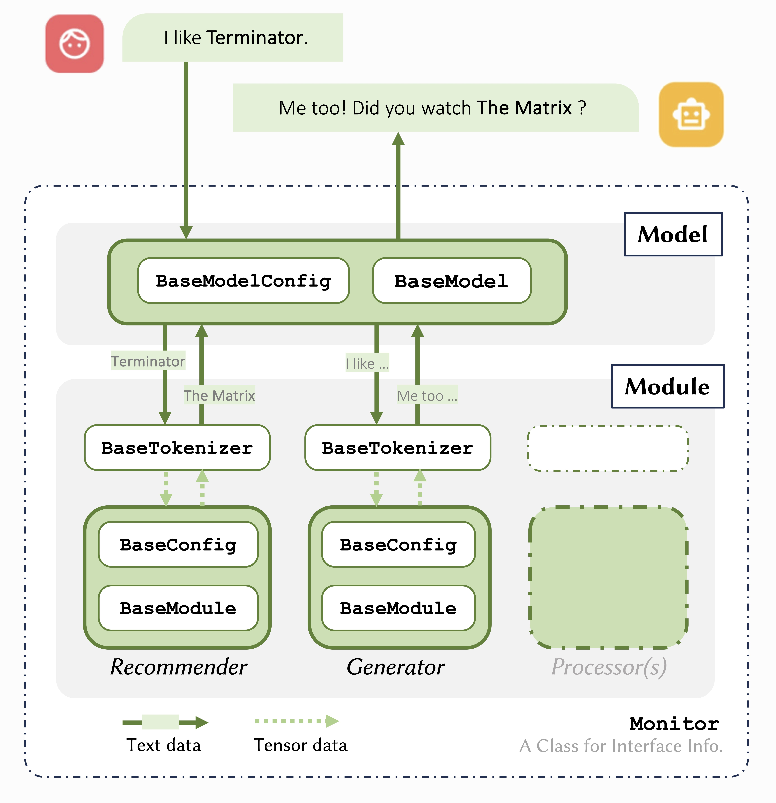

.. RecWizard documentation master file, created by
   sphinx-quickstart on Mon Sep 25 23:48:10 2023.
   You can adapt this file completely to your liking, but it should at least
   contain the root `toctree` directive.

=========
Welcome!
=========

**RecWizard** is a comprehensive toolkit designed for Conversational Recommender System (CRS) research, based on `PyTorch <https://pytorch.org>`_ and `Huggingface <https://huggingface.co/>`_.

.. include:: quick_start/installation.rst

.. toctree::
   :caption: GET STARTED
   :maxdepth: 2
   :hidden:

   quick_start/concept
   quick_start/installation
   quick_start/example

.. toctree::
   :caption: USER GUIDE
   :maxdepth: 2
   :hidden:

   usage/loading/index 
   usage/interface/index
   usage/development/index

.. toctree::
   :caption: API REFERENCE
   :maxdepth: 2
   :hidden:

   reference/baseclass/index 
   reference/pipelines/index
   reference/modules/index

